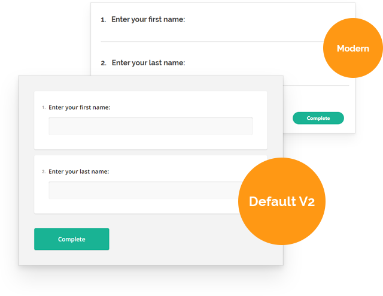
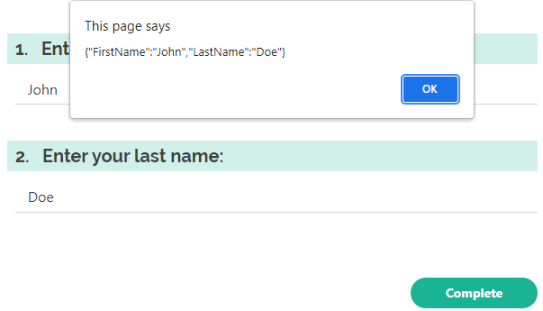

# Add a Survey to a React Application

This step-by-step tutorial will help you get started with the SurveyJS Library in a React application. To add a survey to your React application, follow the steps below:

- [Install the `survey-react-ui` npm Package](#install-the-survey-react-npm-package)
- [Configure Styles](#configure-styles)
- [Create a Model](#create-a-model)
- [Render the Survey](#render-the-survey)
- [Handle Survey Completion](#handle-survey-completion)

As a result, you will create a survey displayed below:

<iframe src="https://codesandbox.io/embed/surveyjs-add-a-survey-to-a-react-application-j206b?fontsize=14&hidenavigation=1&theme=dark"
    style="width:100%; height:500px; border:0; border-radius: 4px; overflow:hidden;"
    title="SurveyJS - Add a Survey to a React Application"
    sandbox="allow-forms allow-modals allow-popups allow-presentation allow-same-origin allow-scripts"
></iframe>

You can find the full code in the following GitHub repository: <a href="https://github.com/surveyjs/code-examples/tree/main/get-started-library/react" target="_blank">Get Started with SurveyJS - React</a>.

## Install the `survey-react-ui` npm Package

The SurveyJS Library for React consists of two npm packages: [`survey-core`](https://www.npmjs.com/package/survey-core) (platform-independent code) and [`survey-react-ui`](https://www.npmjs.com/package/survey-react-ui) (rendering code). Run the following command to install `survey-react-ui`. The `survey-core` package will be installed automatically because it is listed in `survey-react-ui` dependencies.

```cmd
npm install survey-react-ui --save
```

## Configure Styles

SurveyJS ships with the Modern and Default V2 UI themes illustrated below.



Open the React component in which your survey will be and import a style sheet that implements the required theme.

```js
// Modern theme
import 'survey-core/modern.min.css';
// Default V2 theme
// import 'survey-core/defaultV2.min.css';
```

To apply the imported theme, call the `applyTheme(themeName)` method. Depending on the theme, pass `"modern"` or `"defaultV2"` as the method's argument. For instance, the following code applies the Modern theme:

```js
import { StylesManager } from 'survey-core';

StylesManager.applyTheme("modern");
```

## Create a Model

A model describes the layout and contents of your survey. The simplest survey model contains one or several questions without layout modifications.

Models are specified by model definitions (JSON objects). For example, the following model definition declares two [textual questions](https://surveyjs.io/Documentation/Library?id=questiontextmodel), each with a [title](https://surveyjs.io/Documentation/Library?id=questiontextmodel#title) and a [name](https://surveyjs.io/Documentation/Library?id=questiontextmodel#name). Titles are displayed on screen. Names are used to identify the questions in code.

```js
const surveyJson = {
  elements: [{
    name: "FirstName",
    title: "Enter your first name:",
    type: "text"
  }, {
    name: "LastName",
    title: "Enter your last name:",
    type: "text"
  }]
};
```

To instantiate a model, pass the model definition to the [Model](https://surveyjs.io/Documentation/Library?id=surveymodel) constructor as shown in the code below. The model instance will be later used to render the survey.

```js
import { ..., Model } from 'survey-core';
// ...
function App() {
  const survey = new Model(surveyJson);

  return ... ;
}
```

<details>
    <summary>View full code</summary>  

```js
import 'survey-core/modern.min.css';
// import 'survey-core/defaultV2.min.css';
import { StylesManager, Model } from 'survey-core';

StylesManager.applyTheme("modern");

const surveyJson = {
  elements: [{
    name: "FirstName",
    title: "Enter your first name:",
    type: "text"
  }, {
    name: "LastName",
    title: "Enter your last name:",
    type: "text"
  }]
};

function App() {
  const survey = new Model(surveyJson);

  return ...;
}

export default App;
```
</details>

## Render the Survey
To render a survey, import the `Survey` component, add it to the template, and pass the model instance you created in the previous step to the component's `model` attribute:

```js
import { Survey } from 'survey-react-ui';
// ...
const surveyJson = { ... };

function App() {
  const survey = new Model(surveyJson);

  return <Survey model={survey} />;
}
```

If you replicate the code correctly, you should see the following survey:


<details>
    <summary>View full code</summary>  

```js
import 'survey-core/modern.min.css';
// import 'survey-core/defaultV2.min.css';
import { StylesManager, Model } from 'survey-core';
import { Survey } from 'survey-react-ui';

StylesManager.applyTheme("modern");

const surveyJson = {
  elements: [{
    name: "FirstName",
    title: "Enter your first name:",
    type: "text"
  }, {
    name: "LastName",
    title: "Enter your last name:",
    type: "text"
  }]
};

function App() {
  const survey = new Model(surveyJson);

  return <Survey model={survey} />;
}

export default App;
```
</details>

## Handle Survey Completion

After a respondent completes a survey, the results are available within the [onComplete](https://surveyjs.io/Documentation/Library?id=surveymodel#onComplete) event handler. In real-world applications, you should send the results to a server where they will be stored in a database and processed. In this tutorial, the results are simply output in an alert dialog:

```js
import { useCallback } from 'react';
// ...
function App() {
  const survey = new Model(surveyJson);
  const alertResults = useCallback((sender) => {
    const results = JSON.stringify(sender.data);
    alert(results);
  }, []);

  survey.onComplete.add(alertResults);

  return <Survey model={survey} />;
}

```



As you can see, survey results are saved in a JSON object. Its properties correspond to the `name` property values of your questions in the model definition.

To view the application, run `npm run start` in a command line and open [http://localhost:3000/](http://localhost:3000/) in your browser.

<details>
    <summary>View full code</summary>  

```js
import { useCallback } from 'react';

import 'survey-core/modern.min.css';
// import 'survey-core/defaultV2.min.css';
import { StylesManager, Model } from 'survey-core';
import { Survey } from 'survey-react-ui';

StylesManager.applyTheme("modern");

const surveyJson = {
  elements: [{
    name: "FirstName",
    title: "Enter your first name:",
    type: "text"
  }, {
    name: "LastName",
    title: "Enter your last name:",
    type: "text"
  }]
};

function App() {
  const survey = new Model(surveyJson);
  const alertResults = useCallback((sender) => {
    const results = JSON.stringify(sender.data);
    alert(results);
  }, []);

  survey.onComplete.add(alertResults);

  return <Survey model={survey} />;
}

export default App;
```
</details>

<a href="https://github.com/surveyjs/code-examples/tree/main/get-started-library/react" target="_blank">View full code on GitHub</a>

## Further Reading

- [Create a Simple Survey](https://surveyjs.io/Documentation/Library?id=design-survey-create-a-simple-survey)
- [Create a Multi-Page Survey](https://surveyjs.io/Documentation/Library?id=design-survey-create-a-multi-page-survey)
- [Create a Quiz](https://surveyjs.io/Documentation/Library?id=design-survey-create-a-quiz)